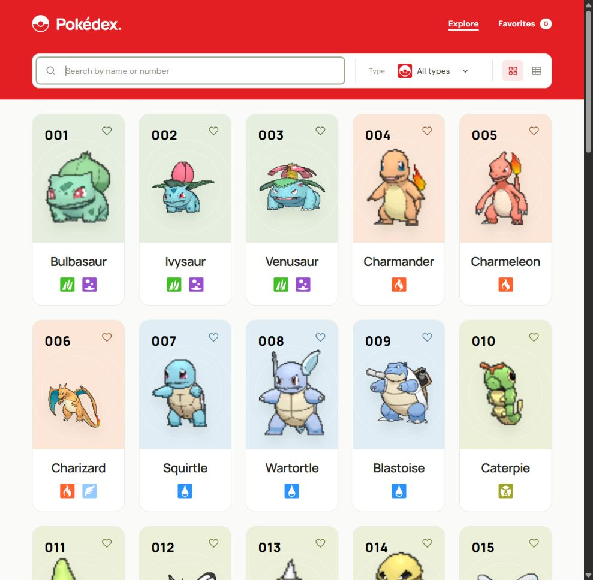
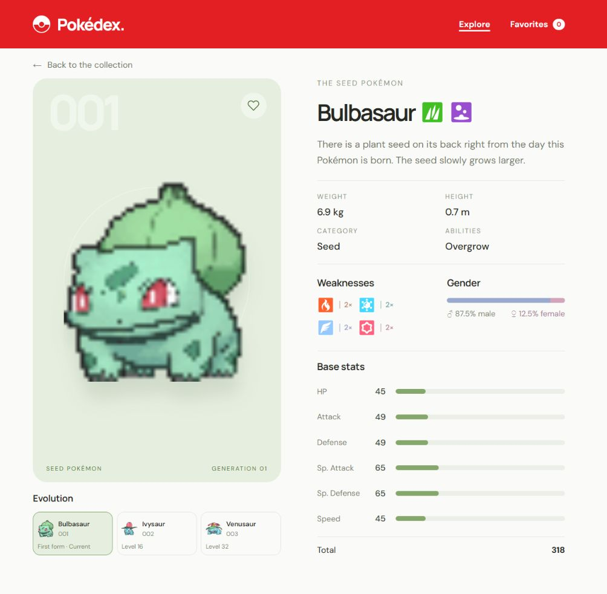

# Pokédex

Ever forget what a Pokémon is weak against, or just wanna look through your favorites?

This is a Pokédex for **905 Pokémon from Generations I–VIII**, from Bulbasaur all the way to Enamorus. Look up a name, filter by type, compare stats, or click on a Pokémon to see its evolution. And yes, most of them move. <br><br>

<br><br>

## Key Feature

- 905 Pokémon across eight generations, including Hisui.
- Animated Pokémon artwork, with still artwork where animations aren't available.
- Search by name or Pokédex number.
- Pick several types and switch between **Or** and **All** to narrow things down.
- Switch between the card grid and a sortable stats table.
- Check abilities, weaknesses, gender ratios, base stats, and evolution chains.
- Tap the heart to keep your favorites. They're saved in your browser, so no account needed.
- Keep scrolling to load more Pokémon.
- Extra animations for Marshadow, Reshiram, and Zekrom.
- Works on desktop and mobile.

<br><br>

## Preview

### Pokémon Detail

Wanna know what Bulbasaur turns into? Open its page and click through the evolution chain. The measurements, abilities, weaknesses, and stats are right beside the artwork. <br><br>

<br><br>

### Table View

Looking for the fastest Pokémon, or the one with the most HP? Switch to the table icon beside the type filter, then click a column heading to sort. Click anywhere on a row to open that Pokémon, or use its heart to save it. <br><br>

### Type Filter

**Or** shows Pokémon with any of the types you selected. **All** shows Pokémon that have every selected type.

For example, selecting **Grass** and **Poison** with **Or** shows either type. Switch to **All**, and you'll get Pokémon like Bulbasaur that have both. <br><br>

## Tech Stack

HTML, CSS, and vanilla JavaScript. The Pokémon data and artwork are bundled with the site, so browsing doesn't need a live PokéAPI request. Favorites and your preferred view are saved with `localStorage`. <br><br>

## Run Locally

You'll need Node.js 18 or newer. Clone this repo, open the folder, and run:

```sh
git clone https://github.com/Ikkyuuuu/Pokedex.git
cd Pokedex
npm run dev
```

Then open http://127.0.0.1:4173. No packages to install and no build step.

Wanna check the bundled data and artwork?

```sh
npm run check
```

To refresh the catalog, install Python 3 and Pillow (`pip install Pillow`), then run `npm run refresh-data`. This step needs internet. <br><br>

## Deployment Platform

The site is ready for **GitHub Pages**. To publish it:

1. Open **Settings → Pages** in this repo and choose **GitHub Actions** as the source.
2. Go to **Actions → Deploy GitHub Pages → Run workflow** and select `main`.
3. Once it finishes, open https://Ikkyuuuu.github.io/Pokedex/.

The workflow checks the catalog and publishes the `dist/` folder. Run it again whenever you want to publish an update. Pushing changes by itself doesn't deploy the site. <br><br>

## Source

**Pokémon data** &nbsp;:&nbsp; [PokéAPI](https://pokeapi.co/) <br>
**Animated artwork** &nbsp;:&nbsp; [Project Pokémon Sprite Index](https://projectpokemon.org/home/docs/spriteindex_148/) <br>
**Design reference** &nbsp;:&nbsp; [Pokédex Pokémon App on Figma Community](https://www.figma.com/community/file/1202971127473077147/pokedex-pokemon-app) <br><br>

Artwork sources and fallbacks are recorded in [`scripts/sprite-sources.json`](scripts/sprite-sources.json). The animations are pre-rendered images, so you can't rotate them like an interactive 3D model.

Pokémon belongs to Nintendo, Game Freak, and The Pokémon Company. This is an unofficial fan project.
